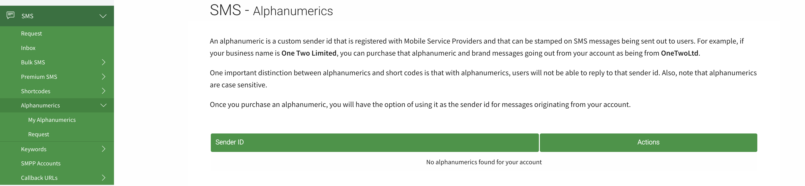

## Running the Express SMS Server

### Prerequisites
Ensure you have Node.js installed on your system. 
Remember you Need an Africastalking Sender Id, Make sure to Request for One and If in a their Hackathon one will temporarily assigned to you after request. check the Alphaneumeric to make sure you have one

Then, install the required dependencies:

```sh
npm install --save-dev typescript @types/node @types/express ts-node cors @types/cors dotenv
npm i --save-dev africastalking @types/africastalking 

```
##### To Run the Application
 ```sh
 npx tsc && node dist/index.js
 ```

 The dist Folder is Auto Generated

 #### To Ensure Run the Application with Latest Changes and Updates 
 install
 ```sh
 npm install --save-dev nodemon
 ```
 then check the package.json file and add the below if not already there
```sh
   "scripts": {
    "start": "node dist/index.js",
    "build": "tsc",
    "dev": "nodemon --ext ts --exec 'npx tsc && node dist/index.js'"
  },
  ```

