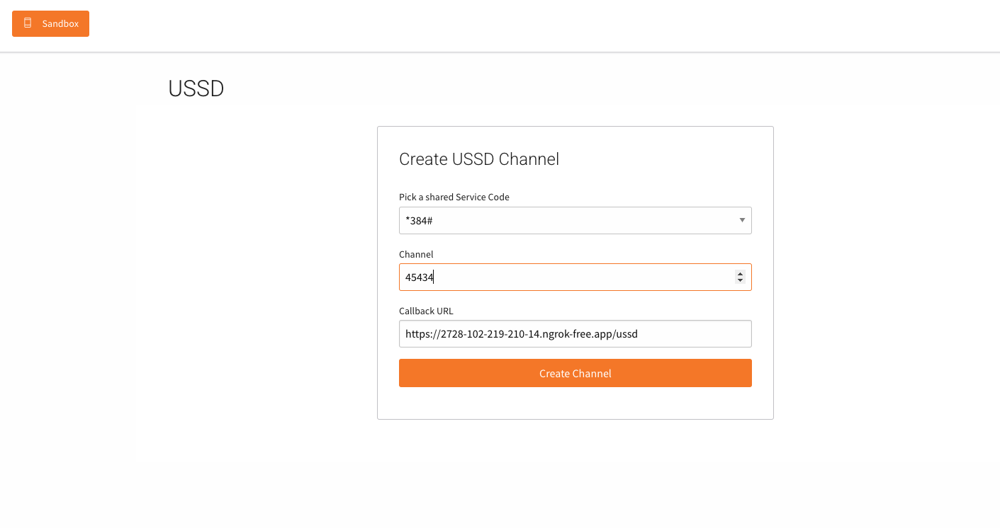

# Africa's Talking USSD Integration with Flask

This project demonstrates how to build a USSD application using Flask and connect it to Africa's Talking.

## Prerequisites

- Python 3.7+
- [Flask](https://flask.palletsprojects.com/)
- [ngrok](https://ngrok.com/) (for local development)
- Africa's Talking account

## Setup

1. **Clone this repository and install dependencies:**

   ```sh
   pip install flask flask-cors
   ```

2. **Run the Flask app:**

   ```sh
   python app.py
   ```

   By default, the app runs on `http://localhost:5001`.

3. **Expose your local server using ngrok:**

   ```sh
   ngrok http 5001
   ```

   Copy the HTTPS URL provided by ngrok (e.g., `https://abcd1234.ngrok.io`).

4. **Configure Africa's Talking Sandbox:**

   - Go to your [Africa's Talking dashboard](https://account.africastalking.com/apps/sandbox/ussd/channel/create).

   in sandbox development you can have a maximum of 2 channels as of this writing.

   - Under **Channels**, add your ngrok URL followed by `/ussd` as the callback URL (e.g., `https://abcd1234.ngrok.io/ussd`).
   - Refer to the image below for guidance:

     

   - The **Channel** is a 5-digit number (e.g., `12345`). You can use any random 5-digit number for testing.
   - If you need your own service code for production, please [contact Africa's Talking](https://africastalking.com/about/#contactus).

## Usage

- Dial the sandbox USSD code on your phone or simulator.
- Interact with the menu as defined in `app.py`.

## Support

For more information or to request a dedicated service code, visit Africa's Talking contact (https://africastalking.com/about/#contactus)
